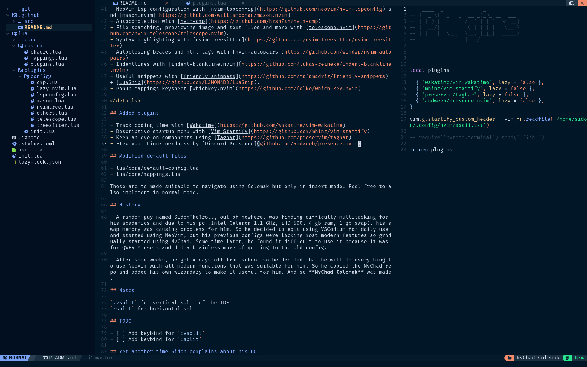
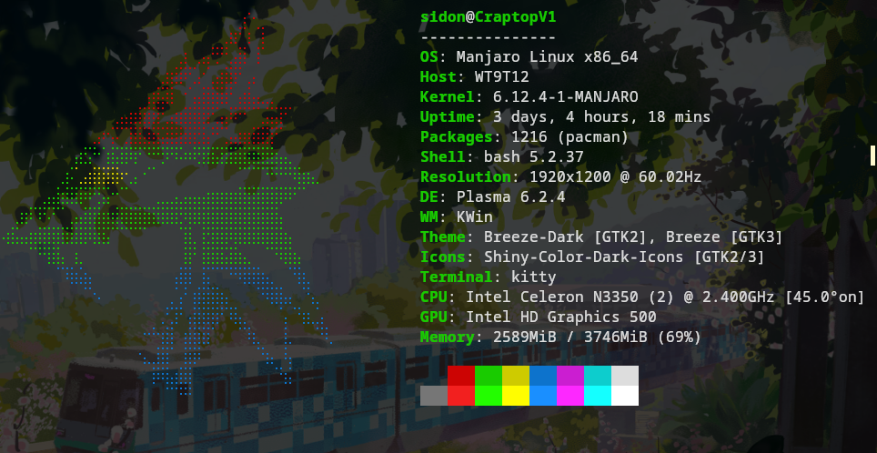

# 
 NvChad Colemak

 

Configs for NvChad for people who use **Colemak keyboard layout**. With added features and keybinds while keeping most of the original styling of NvChad.

To use the config. Just make sure you have the original NvChad installed with the minimal settings on (don't install extra stuff during the initialization) and then merge and replace the original files with the files in the repo (ik that its mostly the custom folder but I made changes in the root files too so just do it). 

## Showcase 

## Now what? 

- Feel free to make adjustment and fix any bugs that you find and let me know through PR or in my Discord. 

- If you think that it needs some new features do the same or if you are feeling shy, just use it yourelf, you don't have to do it if you don't want. 

## Few words from me (you don't have to read)

Works started on 4th September, 2023 and writing this on 6th September, 2023, basically the same year.  
Became dizzy after smashing my head on the table for hours figuring out how Lua works.  

## Default plugins

 Click to expand 
 

- Themes by [base46 plugin](https://github.com/NvChad/base46)
- Inbuilt terminal [Nvterm](https://github.com/NvChad/nvterm)
- NvChad updater, hide & unhide terminal buffers with [NvChad extensions](https://github.com/NvChad/extensions)
- Lightweight & performant ui plugin with [NvChad UI](https://github.com/NvChad/ui). Provides statusline modules, tabufline (tabs + buffer manager).cheatsheet, etc.
- File navigation with [nvim-tree.lua](https://github.com/kyazdani42/nvim-tree.lua)
- Configurable icons with [nvim-web-devicons](https://github.com/kyazdani42/nvim-web-devicons)
- Git diffs and more with [gitsigns.nvim](https://github.com/lewis6991/gitsigns.nvim) 
- NeoVim Lsp configuration with [nvim-lspconfig](https://github.com/neovim/nvim-lspconfig) and [mason.nvim](https://github.com/williamboman/mason.nvim)
- Autocompletion with [nvim-cmp](https://github.com/hrsh7th/nvim-cmp)
- File searching, previewing image and text files and more with [telescope.nvim](https://github.com/nvim-telescope/telescope.nvim).
- Syntax highlighting with [nvim-treesitter](https://github.com/nvim-treesitter/nvim-treesitter)
- Autoclosing braces and html tags with [nvim-autopairs](https://github.com/windwp/nvim-autopairs)
- Indentlines with [indent-blankline.nvim](https://github.com/lukas-reineke/indent-blankline.nvim)
- Useful snippets with [friendly snippets](https://github.com/rafamadriz/friendly-snippets) + [LuaSnip](https://github.com/L3MON4D3/LuaSnip).
- Popup mappings keysheet [whichkey.nvim](https://github.com/folke/which-key.nvim)

 

## Added plugins

- Track coding time with [Wakatime](https://github.com/wakatime/vim-wakatime)
- Descriptive startup menu with [Vim Startify](https://github.com/mhinz/vim-startify)
- Keep an eye on components using [Tagbar](https://github.com/preservim/tagbar)
- Flex your Linux nerdness by [Discord Presence](github.com/andweeb/presence.nvim)

## Modified default files 

- lua/core/default-config.lua 
- lua/core/mappings.lua 

These are to made suitable to navigate using Colemak but only in insert mode. Feel free to also implement in normal mode. 

## History

- A random guy named SidonTheTroll, out of nowhere, was finding difficulty multitasking for his academics and due to his pc (Intel Celeron 1.1 GHz, iHD 500, 4 gb ram, 1 gb swap), his swap memory was causing problems for him. So he decided to eqit using VSCodium for daily use and started using NeoVim, but his previous configs were lacking most modern features so gradually started using NvChad. Some time later, he found it difficult to use it because it was for QWERTY users and did a brainless move of getting to the old config. 

- After some weeks, he got 4 days off from school so he decided that he will do everything to use NeoVim with all modern functions that was suitable for him. So he copied the NvChad repo and added his own wizardary to make it useful for him. And so **NvChad Colemak** was made. 

## Notes

`:vsplit` for vertical split of the IDE 
`:split` for horizontal split

## TODO

- [ ] Add keybind for `:vsplit`
- [ ] Add keybind for `:split`

## Yet another time Sidon complains about his PC 

