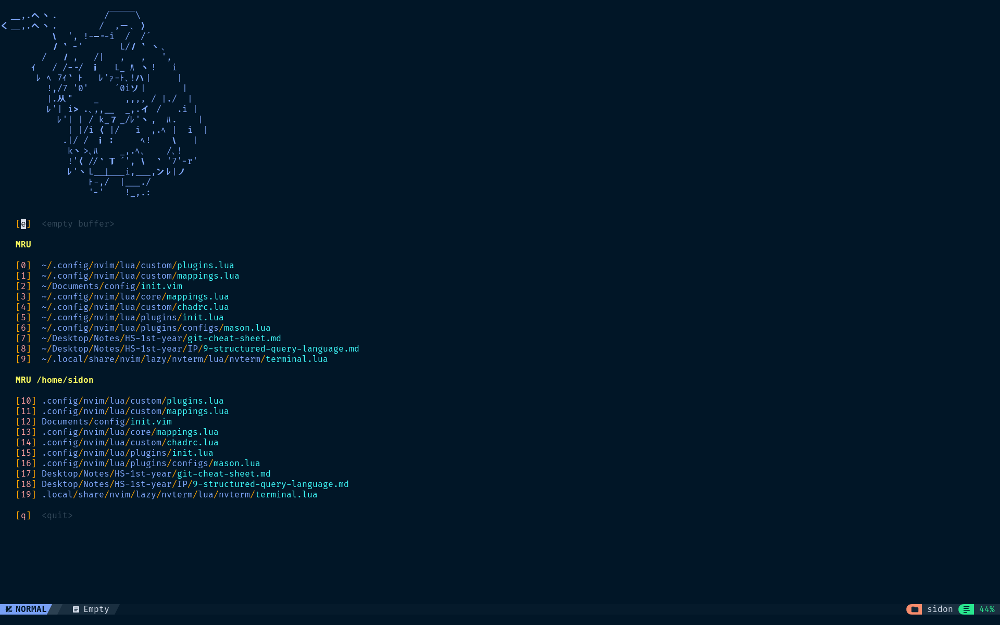

<h1 align='center'>NvChad Colemak</h1>

 

A config which just works in completing essential tasks added with extra 'bloat' to make life a bit easier with focus on work with Colemak-DH keyboard layout. 

**Note that this config is made with Colemak-DH layout in mind. Change a few lines in mappings file to quickly change to any other layout.** 

## Installation 
1. Clone the repo into a folder with `git clone https://github.com/sidonthetroll/nvchad-colemak`
2. Open the config folder of a fresh install of NvChad. 
3. Merge the folders and replace the conflicting files in the config folder. 

This is meant to be a starting config. Your precofigured settings might be lost.

### Packages 
Important packages for configured LSPs to run are provided in `/requirements/` of the project. Install them through pip locally or globally. 

- **Installation:**
    - `pip install -r <requirements-file.txt>`
    - `yay -S clang`

    
Installing in virtual environment

    - **Create a virtual environment:** `python3 -m venv <environment name>`
    - **Activate the virtual environment**: `source /<environment name>/bin/activate`
    - **Install the packages**: `pip install -r <requirements-file.txt>`

## Dependencies 
1. Luarocks 
2. Ctags 
3. xclip/wl-clipboard
4. ripgrep
5. Fish
6. ripgrep
7. devicons
8. sed

> [!NOTE]
> Added **fish** to be used in the Terminal Toggle keybind. The config is found in `/lua/options.lua`.

## Showcase 

## Now what? 
- Feel free to make adjustment and fix any bugs that you find and let me know through PR or in my Discord. 

- If you think that it needs some new features do the same or if you are feeling shy, just use it yourself, you don't have to do it if you don't want. 

## Few words from me (you don't have to read)
Works started on 4th September, 2023 and writing this on 6th September, 2023, basically the same year.  
Became dizzy after smashing my head on the table for hours figuring out how Lua works.  

It's January 4, 2025 at 11:30 PM. I'm actually fixing my code so that I could work on my Craptop regardless of the situation. Also my exams are going on but I don't care.

## Added plugins
- Track coding time with [Wakatime](https://github.com/wakatime/vim-wakatime)
- Descriptive startup menu with [Vim Startify](https://github.com/mhinz/vim-startify)
- Keep an eye on components using [Tagbar](https://github.com/preservim/tagbar)
- Flex your Linux nerdness by [Presence.nvim](https://github.com/andweeb/presence.nvi)
- AutoSaving file by [Auto-save.nvim](https://github.com/pocco81/auto-save.nvim)
- Additional Math function for Markdown with [Friendly Snippets Math](https://github.com/sidonthetroll/friendly-snippets-math)
- Searching and Replacing functions with [nvim-spectre](https://github.com/nvim-pack/nvim-spectre)

## Added keybinds
- **F5** to toggle autosave on/off.
- **F6** to split horizontally.
- **F7** to split vertically.
- **F8** to toggle Tagbar on/off. 
- **F9** to toggle Spectre 

Check these stuff in the cheat sheet (*leader*+ch btw). Remember you can always just see the mappings config. 

Also these are to made suitable to navigate using Colemak but only in insert mode. Feel free to also implement in normal mode. 

## History
- A random guy named SidonTheTroll, out of nowhere, was finding difficulty multitasking for his academics and due to his pc (Intel Celeron 1.1 GHz, iHD 500, 4 gb ram, 1 gb swap), his swap memory was causing problems for him. So he decided to eqit using VSCodium for daily use and started using NeoVim, but his previous configs were lacking most modern features so gradually started using NvChad. Some time later, he found it difficult to use it because it was for QWERTY users and did a brainless move of getting to the old config. 

- After some weeks, he got 4 days off from school so he decided that he will do everything to use NeoVim with all modern functions that was suitable for him. So he copied the NvChad repo and added his own wizardary to make it useful for him. And so **NvChad Colemak** was made. 

- Now in 2025, he started uploading braindead stuff again and this repo is up-to-date again.

## TODO
- [x] Add keybind for `:vsplit`
- [x] Add keybind for `:split`

## Yet another time Sidon complains about his PC 

